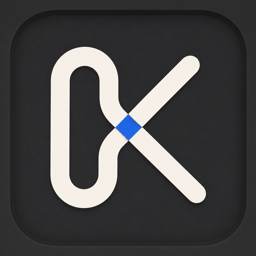

<p align="center">
  
</p>

<h1 align="center">Knot</h1>

<p align="center">把日常 Mac 工具，串联在一起。</p>

<p align="center">
  <a href="https://github.com/baomi-app/knot/releases/latest">下载 Mac 版</a> ·
  <a href="README.md">English</a>
</p>

<p align="center">macOS 14+ · Apple Silicon 和 Intel · MIT</p>

## 功能

- 搜索应用、文件、命令和 Quicklinks
- 加密剪贴板历史
- 窗口分屏与菜单栏整理
- 截图、标注和本地 OCR
- 计算器与自定义全局快捷键

使用 SwiftUI 和 AppKit 构建。无需账号，无广告或分析服务。

## 构建

需要 Xcode 和 [XcodeGen](https://github.com/yonaskolb/XcodeGen)。

```sh
xcodegen generate
xcodebuild -project Knot.xcodeproj -scheme Knot -configuration Debug build CODE_SIGNING_ALLOWED=NO
```

将 `build` 换成 `test -destination 'platform=macOS'` 可运行单元测试。[发布指南](docs/UPDATES.md)。

## 隐私

剪贴板历史在本地加密，OCR 在设备端完成。默认开启的自动更新检查会连接 GitHub，可在 Settings → General 关闭。[隐私政策](docs/privacy-policy.zh.md)。

## 许可证

[MIT](LICENSE) · [第三方声明](THIRD_PARTY_NOTICES.md)
